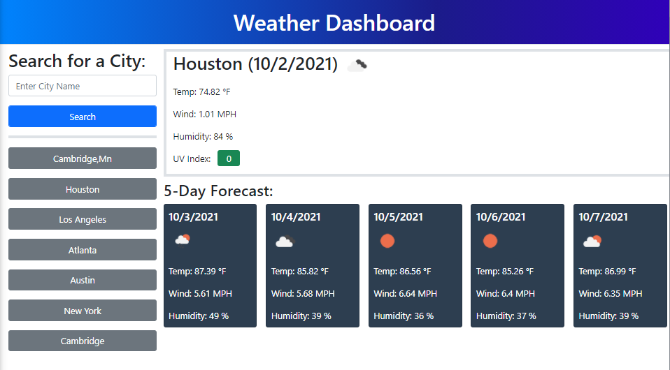

# Weather Dashboard

## Description
A simple weather dashboard utilizing API calls to OpenWeather

## Usage
To use, Enter the name of a US city in the search box (can also do city,state with no spaces), then press the search button.
The current weather conditions, along with a five day forecast are displayed. The city is also displayed in the recent search history below the search button.
You may also click a recent search history button. This will pull up the weather for that city once again.

## Author
Elliott Kvamme, 2021

## Live Site
View the live site here: [Live Site](https://Bycicleace.github.io/weather-dashboard)

